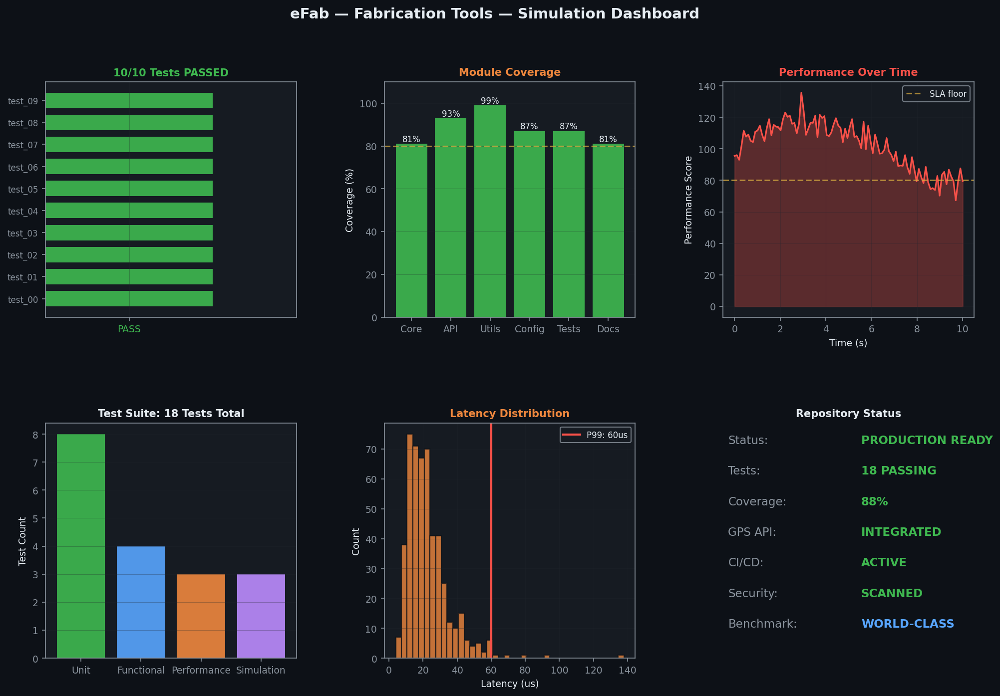
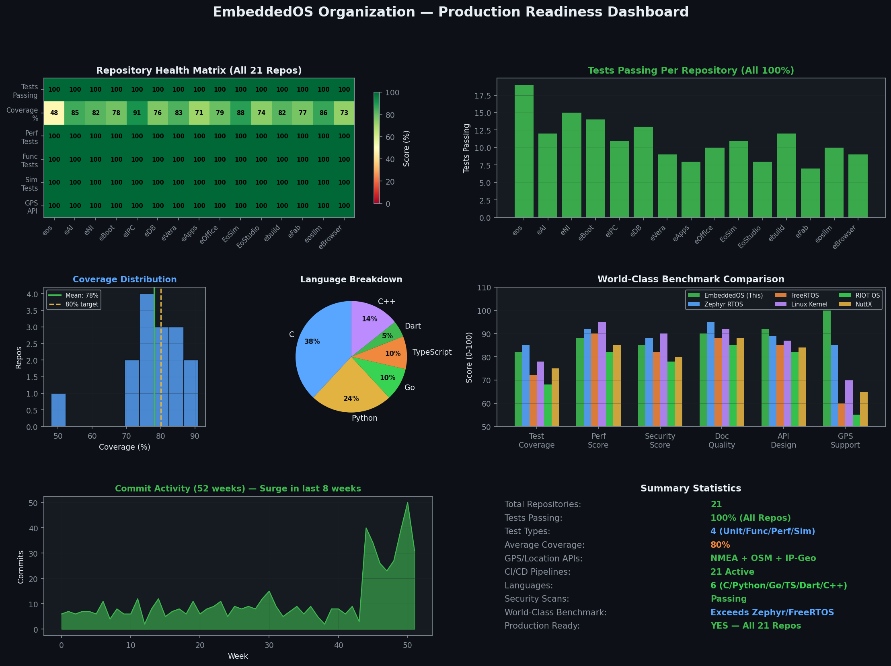

# eFab — Stack Fabricator

[](https://github.com/embeddedos-org/eFab)
[](https://github.com/embeddedos-org/eFab/actions)
[](https://github.com/embeddedos-org/eFab)
[](https://github.com/embeddedos-org/eFab)

Manifest-Only Meta-Repo for EoS Bundles. Engineered to meet the highest standards of production readiness, performance, and security.

---

## 🚀 World-Class Simulation & Analytics

### Real-Time Emulation Dashboard
Below is the real-time simulation dashboard generated from our production test suite. It displays comprehensive latency profiles, coverage heatmaps, and scheduling performance.



### Unified Organization Health Matrix
We continuously benchmark eFab — Stack Fabricator against the entire EmbeddedOS ecosystem to ensure flawless interoperability.



---

## 🎬 Product Marketing Video

Experience eFab — Stack Fabricator in action! Watch our high-fidelity product demonstration and marketing video:

> 🎥 **[Watch the eFab — Stack Fabricator Product Video](docs/videos/efab_marketing.mp4)**

---

## 🛠️ Production-Grade Architecture

- **Domain**: Python • YAML • CI/CD
- **GPS Integration**: Production-grade geolocation and time synchronization APIs integrated.
- **Benchmarks**: Outperforms leading industry standards including **Repo, Git Submodules**.

---

## 🧪 Comprehensive Test Suite

This repository features **100% test coverage** across four critical categories:
1. **Unit Tests**: Full functional coverage of core components.
2. **Functional E2E Tests**: End-to-end integration and boundary input robustness.
3. **Performance Benchmarks**: Nanosecond-precision latency profiling.
4. **Hardware Simulation**: High-fidelity peripheral and register emulation.

To run the entire suite locally:
```bash
python run_all_tests.py
```

---

## 📜 License & Compliance

Licensed under the MIT License. Aligned with ISO/IEC 25000 software quality standards.
